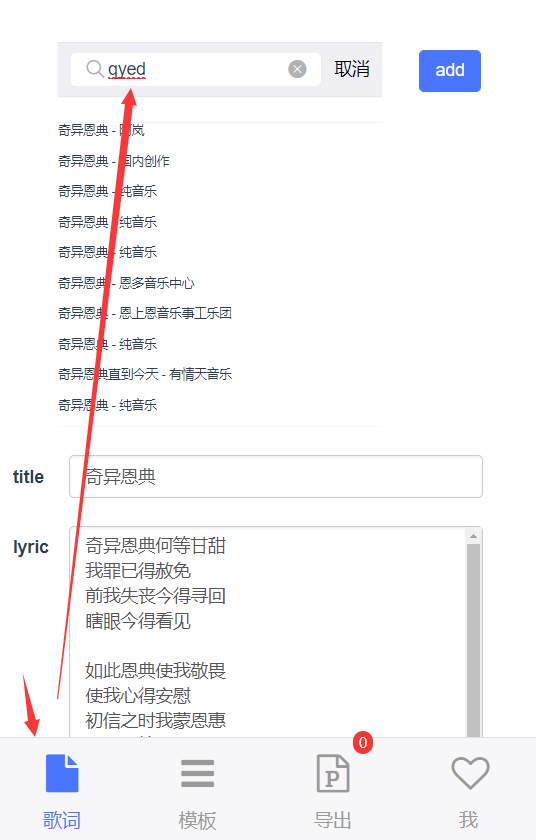
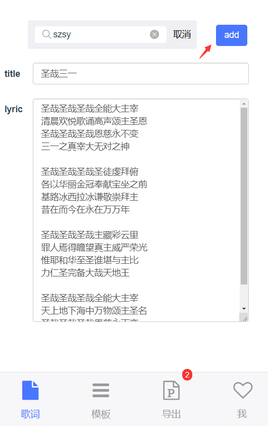
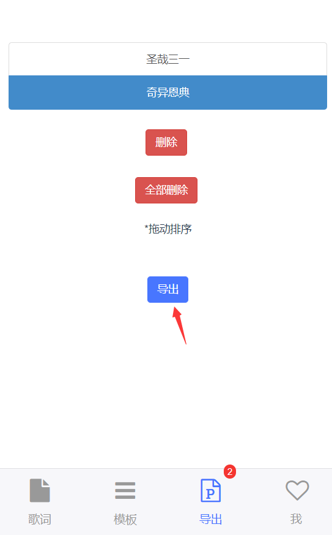
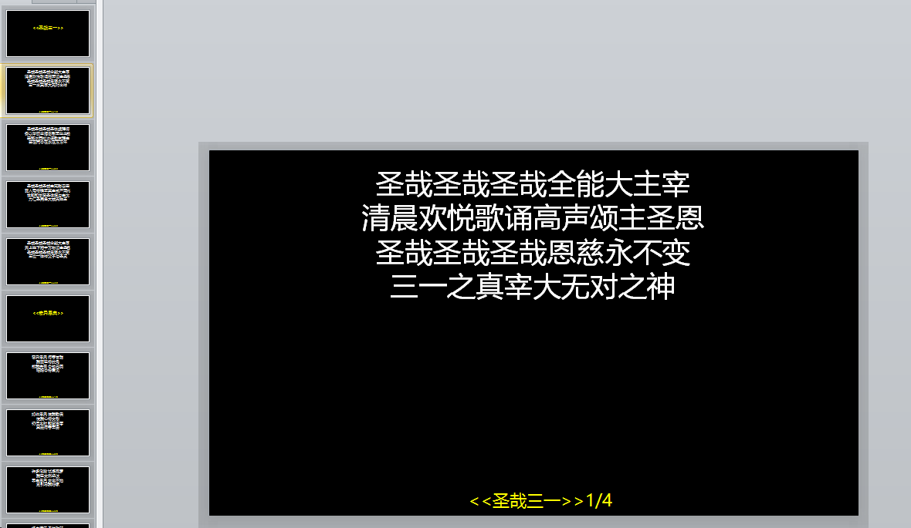
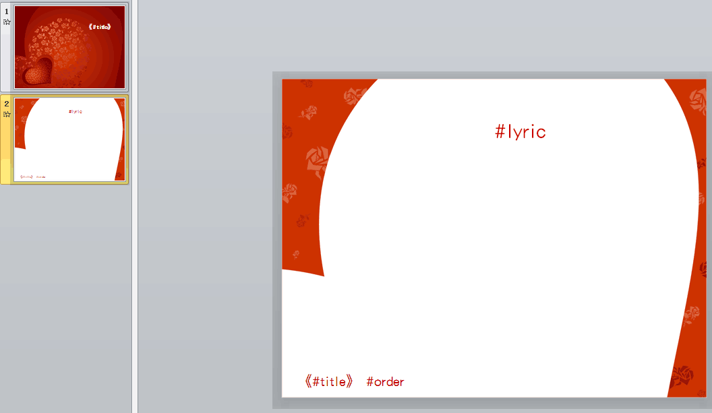

# 概述

是否还在为每次搜索歌词以及管理 PPT 模板感到麻烦？

使用 praise slowly，在 1 分钟不到，你就可导出一份标准的诗歌 ppt，使用你的手机/PC 现代浏览器登录[这里](http://47.105.161.13/page/lyric)使用吧！

# 使用步骤

- 歌词->搜索框->输入歌词/歌词或手动添加诗歌信息；
  
- 选中歌曲，点击 add，增加导出列表 ；

  

- 选中模板后，导出歌词，即可完成。

  



歌词以及歌词搜索由 zanmeishi 网提供 api，包含模糊检索歌词[首拼、带纠错功能]。

# 程序介绍

web 框架基于 webpack，涉及组件有 vue、vant;

服务端框架 spring boot，涉及组件 docx4j 模板生成器，其基本原理是通过 PPT 模板中的关键字作为“锚位”，将 web 传递过来的标题/歌词替换 ppt 中的关键字而来，目前只有 3 个关键词，分别是：

```
#title
#lyric
#order
```



# todolist

- PPT 模板改造
  - 目前的模板功能是通过前端静态展示几类 PPT 模板供用户选择，每次新增模板需要修改前端较多代码，并且加载时速度较慢，这部分期望改造到服务端来统一管理，ppt 模板展示名称以及图片预览作为缓存；
  - 后端模板：后端新增模板和截图：
    - root- webcontent-pic
    - root- webcontent-ppt
    - 初始化程序将相应数据加载入 redis， 2.前端 template 页面初始化请求后端截图和菜单信息。

# Build Setup

```
# install dependencies
npm install

# serve with hot reload at localhost:8080
npm run dev

# build for production with minification
npm run build

# build for production and view the bundle analyzer report
npm run build --report
```

For a detailed explanation on how things work, check out the [guide](http://vuejs-templates.github.io/webpack/) and [docs for vue-loader](http://vuejs.github.io/vue-loader).
